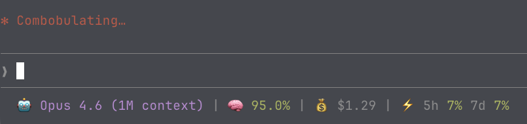

# cc-statusline

A custom status line for [Claude Code](https://docs.anthropic.com/en/docs/claude-code) that shows model info, context usage, session cost, and rate limits at a glance.



## What it shows

| Segment | Description |
|---------|-------------|
| 🤖 Model | Current model name |
| 🧠 Context | Remaining context window %, color-coded (green > 30%, yellow 10-30%, red < 10%) |
| 💰 Cost | Session cost in USD (hidden when $0) |
| ⚡ Rate limits | 5-hour and 7-day usage %, color-coded (green < 50%, yellow 50-80%, red > 80%). Only visible for Claude.ai subscribers after the first API response |

## Installation

### 1. Clone the repo

```sh
git clone https://github.com/raduloov/cc-statusline.git ~/.claude/cc-statusline
```

### 2. Make the script executable

```sh
chmod +x ~/.claude/cc-statusline/statusline.js
```

### 3. Configure Claude Code

Add this to your `~/.claude/settings.json`:

```json
{
  "statusLine": {
    "type": "command",
    "command": "~/.claude/cc-statusline/statusline.js",
    "padding": 0
  }
}
```

If the file doesn't exist yet, create it with the contents above.

### 4. Restart Claude Code

The status line will appear at the bottom of your terminal on the next session.

## Requirements

- Node.js (any recent version)
- Claude Code CLI
